# 35m.ai - 35Gateway
## 本项目由`Hermes Agent`自主研发、运营，`35m.ai`审核发布

Build real AI products faster, without giving up control.
`35gateway` is a source-available AI gateway from `35m.ai`, built for founders, creator teams, and companies shipping real AI products.

提供稳定可靠99.99%的顶尖模型，更快把 AI 产品接进业务，同时保留你的控制权。
`35gateway` 是 `35m.ai` 旗下的源码开放 AI Gateway，面向创业者、创作者团队和正在交付真实 AI 产品的公司。


Use one gateway to:
- connect multiple model providers
- estimate cost before expensive requests
- inspect logs and async tasks after requests
- keep your own keys, routing, and deployment control

一个产品统一接入全球顶级大模型：
- 统一接多家模型供应商
- 一个模型多个供应商按价格逐个调用（控成本）
- 请求后看日志和异步任务状态（可用率透明）
- 保留你自己的 Key、路由和部署控制权（混合使用自己的key，不浪费每一分算力）

## Product Functions | 产品功能（满血Seedance2.0不限速，HappyHorse接入中）

### 核心控制台

用一个控制台，把模型调用、测试、管理和追踪收口在一起。

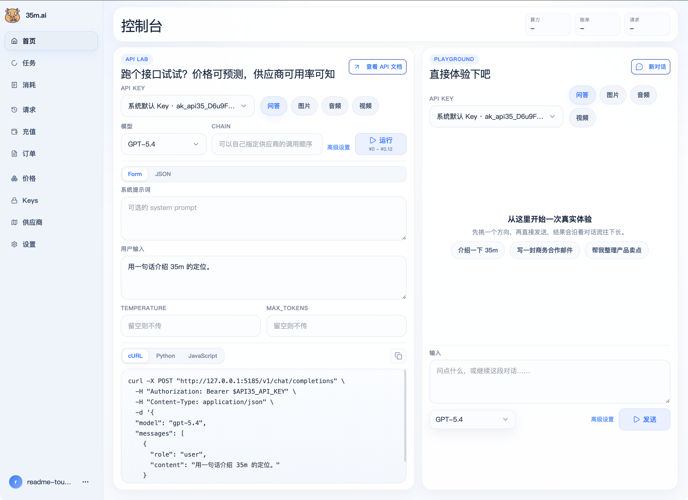

完整页面导览见：[docs/product-tour.md](./docs/product-tour.md)

### 关键页面

| 模型目录与价格参考 | API Keys |
| --- | --- |
| 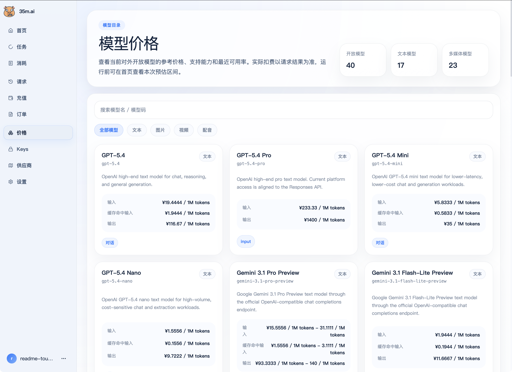 | 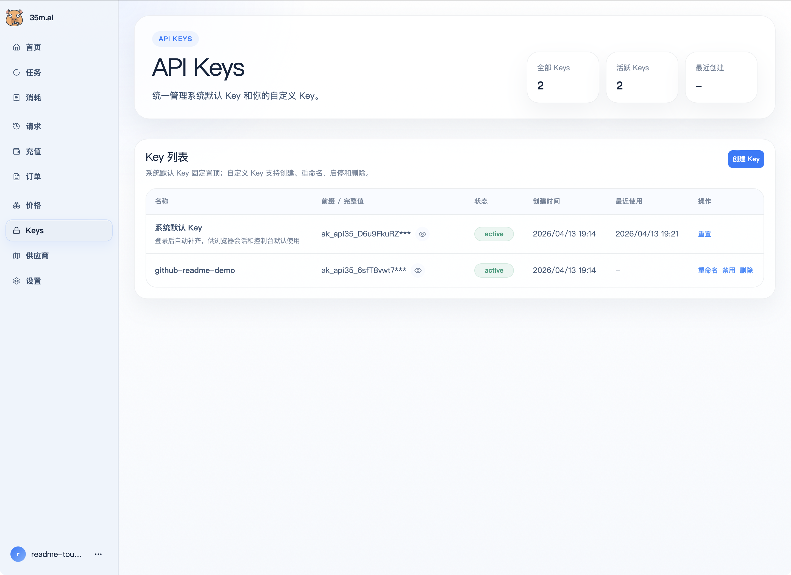 |

| 供应商账号 | 请求日志 |
| --- | --- |
| 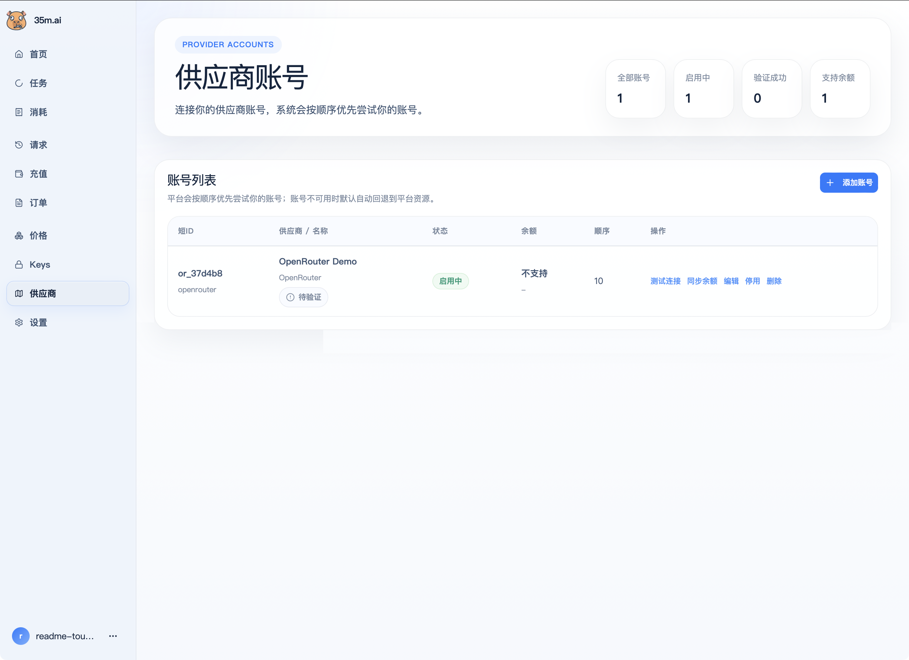 | 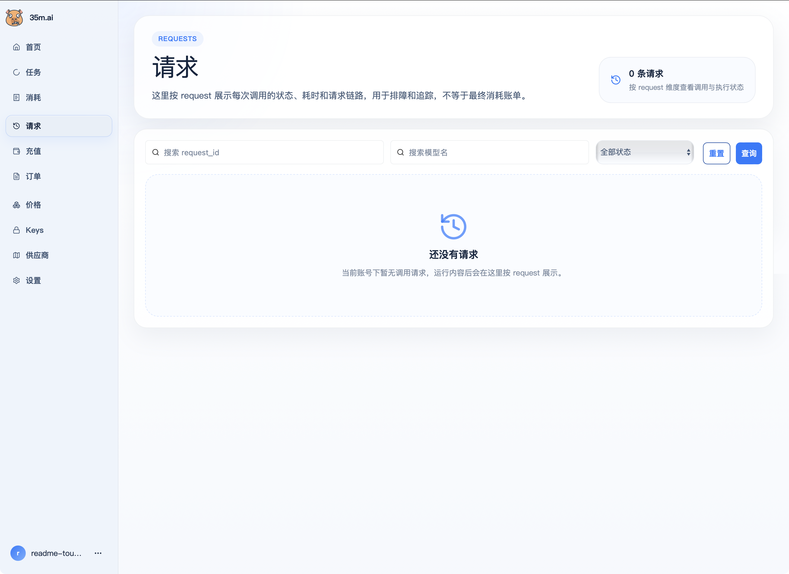 |

### 商业版运营后台

商业版保留完整运营后台，用于用户、支付、模型运营、供应商与兑换码管理。

| 用户管理 | 支付管理 |
| --- | --- |
| 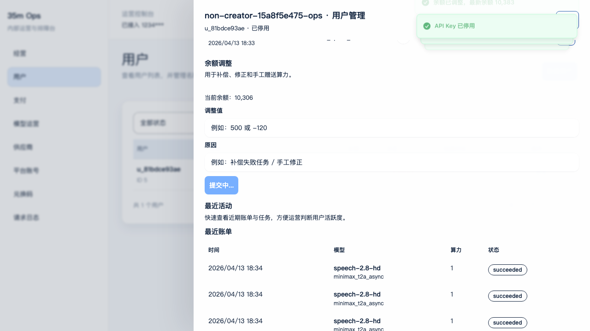 | 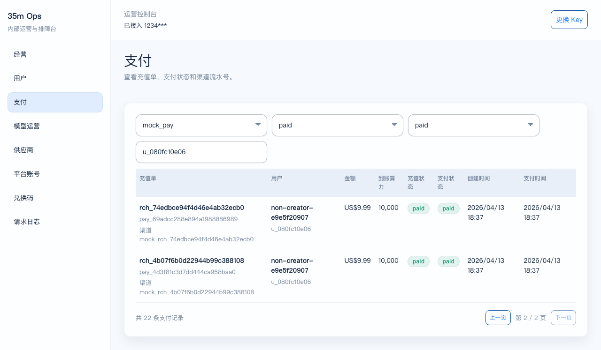 |

| 模型运营 | 供应商运营 |
| --- | --- |
| 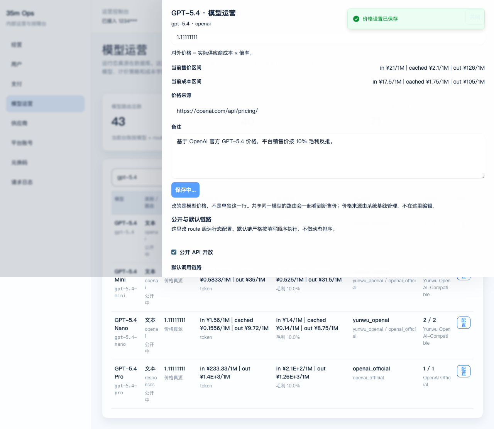 | 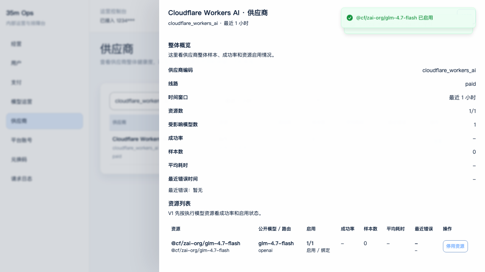 |

| 兑换码管理 | 日志详情 |
| --- | --- |
| 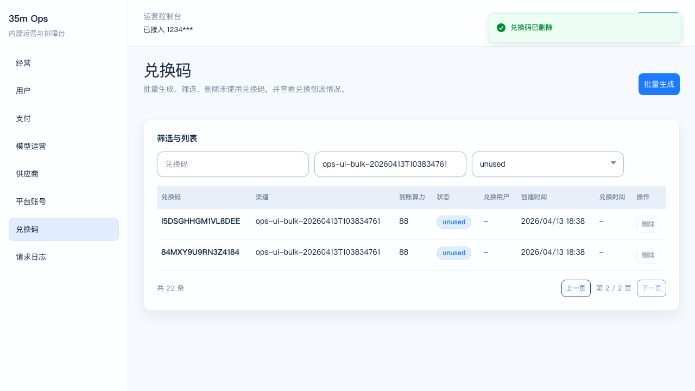 | 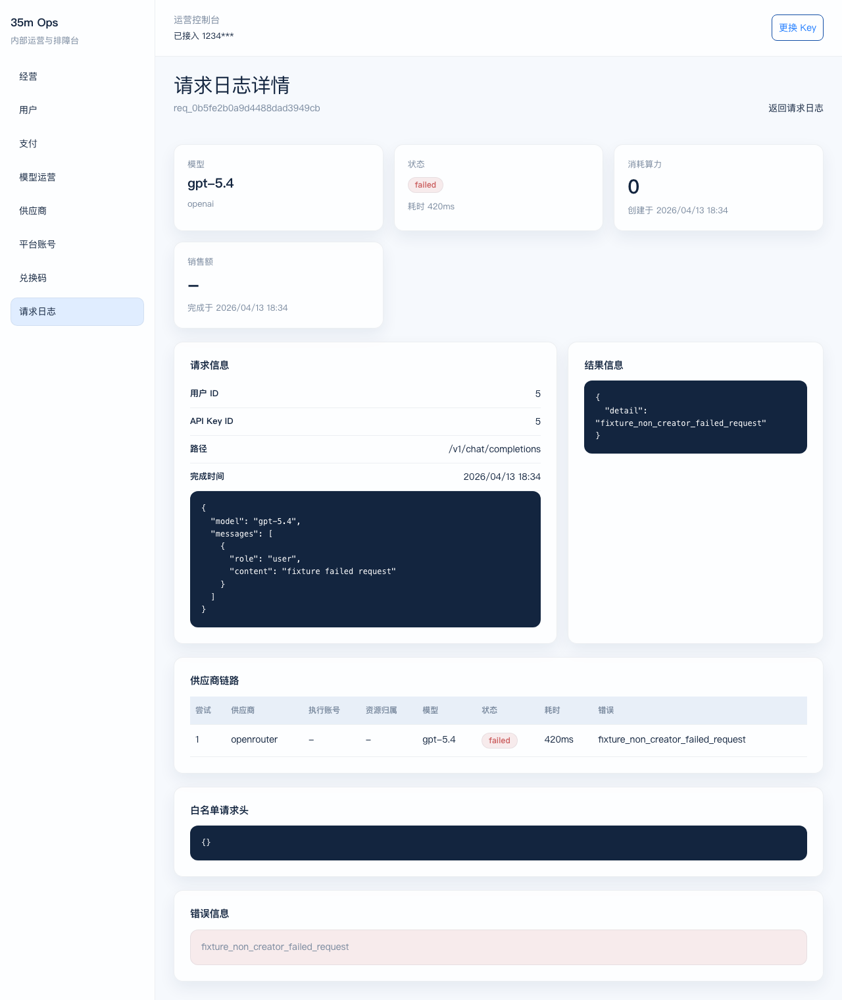 |

## Models Available Today | 当前已接入模型

当前公开可用模型以 `GET /v1/models` 返回为准。下面这张表更适合快速判断你关心的模型有没有接进来。

| 模型名称 | 类型 | 接入状态 | 公开可用 | 备注 |
| --- | --- | --- | --- | --- |
| `veo-3` | 视频 | 已接入 | 是 | 异步任务 |
| `veo-3-fast` | 视频 | 已接入 | 是 | 异步任务 |
| `veo-3.1` | 视频 | 已接入 | 是 | 异步任务 |
| `veo-3.1-fast` | 视频 | 已接入 | 是 | 异步任务 |
| `wan2.6` | 视频 | 已接入 | 是 | 异步任务 |
| `wan2.6-flash` | 视频 | 已接入 | 是 | 异步任务 |
| `minimax-hailuo-02` | 视频 | 已接入 | 是 | 异步任务 |
| `minimax-hailuo-2.3` | 视频 | 已接入 | 是 | 异步任务 |
| `minimax-hailuo-2.3-fast` | 视频 | 已接入 | 是 | 异步任务 |
| `kling-o1` | 视频 | 已接入 | 是 | 异步任务 |
| `viduq3-pro` | 视频 | 已接入 | 是 | 异步任务 |
| `viduq3-turbo` | 视频 | 已接入 | 是 | 异步任务 |
| `seedance-2.0-fast` | 视频 | 已接入 | 是 | Seedance 2.0 Fast， 满血版|
| `seedance-2.0` | 视频 | 已接入 | 是 | Seedance 2.0 满血版 |
| `doubao-seedream-4.5` | 图片 | 已接入 | 是 | Seedream |
| `doubao-seedream-5.0-lite` | 图片 | 已接入 | 是 | Seedream |
| `nano-banana` | 图片 | 已接入 | 是 | Banana |
| `nano-banana-2` | 图片 | 已接入 | 是 | Banana |
| `nano-banana-pro` | 图片 | 已接入 | 是 | Banana |
| `MJv6` | 图片 | 规划中 | 否 | 当前仓内未公开配置 |
| `MJv7` | 图片 | 规划中 | 否 | 当前仓内未公开配置 |
| `qwen-voice-enrollment` | 音频 | 已接入 | 是 | Voice clone |
| `qwen3-tts-flash` | 音频 | 已接入 | 是 | TTS |
| `qwen3-tts-instruct-flash` | 音频 | 已接入 | 是 | TTS |
| `qwen3-tts-vc-2026-01-22` | 音频 | 已接入 | 是 | Voice conversion |
| `speech-2.8-hd` | 音频 | 已接入 | 是 | 异步音频任务 |
| `speech-2.8-turbo` | 音频 | 已接入 | 是 | 异步音频任务 |
| `gpt-5` | 文本 | 已接入 | 是 | OpenAI-compatible |
| `gpt-5.2` | 文本 | 已接入 | 是 | OpenAI-compatible |
| `gpt-5.4` | 文本 | 已接入 | 是 | OpenAI-compatible |
| `gpt-5.4-pro` | 文本 | 已接入 | 是 | Responses |
| `gpt-5.4-mini` | 文本 | 已接入 | 是 | OpenAI-compatible |
| `gpt-5.4-nano` | 文本 | 已接入 | 是 | OpenAI-compatible |
| `DeepSeek-V3.2` | 文本 | 已接入 | 是 | OpenAI-compatible |
| `MiniMax-M2.7` | 文本 | 已接入 | 是 | OpenAI-compatible |
| `MiniMax-M2.7-highspeed` | 文本 | 已接入 | 是 | OpenAI-compatible |
| `gemini-2.5-flash` | 文本 | 已接入 | 是 | OpenAI-compatible |
| `gemini-2.5-flash-lite` | 文本 | 已接入 | 是 | OpenAI-compatible |
| `gemini-2.5-pro` | 文本 | 已接入 | 是 | Gemini / OpenAI-compatible |
| `gemini-3-flash-preview` | 文本 | 已接入 | 是 | OpenAI-compatible |
| `gemini-3.1-flash-lite-preview` | 文本 | 已接入 | 是 | OpenAI-compatible |
| `gemini-3.1-pro-preview` | 文本 | 已接入 | 是 | OpenAI-compatible |
| `glm-4.7-flash` | 文本 | 已接入 | 是 | OpenAI-compatible |
| `openrouter-free` | 文本 | 已接入 | 是 | OpenAI-compatible |

## Built For | 这产品适合谁

### Founders and indie builders | 创业者与独立开发者

If you are building an AI product and do not want to wire every provider by hand, this is for you.

如果你正在做 AI 产品，不想每家供应商都自己接一遍，这就是给你的。

### Creator teams and studios | 创作者团队与内容工作室

If you need stable access to text, image, audio, and video models, and want to see cost and task status clearly, this is for you.

如果你要稳定调用图文音视频模型，并且希望清楚看到成本和任务状态，这就是给你的。

### Companies and technical teams | 企业与技术团队

If you want self-hosting, visible logs, controllable routing, and your own provider keys, this is for you.

如果你希望自托管、日志可见、路由可控、保留自己的 provider key，这就是给你的。

### Agencies, resellers, and token export teams | 代理商、转售商与 Token 出海团队

If you want to resell model access, ship branded offerings, or build custom delivery for clients without rebuilding the full gateway stack from scratch, this is for you.

如果你是做 Token 出海、模型转售、渠道分发或客户定制交付的代理商，希望在不重造整套网关的前提下快速对外提供服务，这就是给你的。

- support reselling and channel distribution
- support white-label delivery
- support custom deployment and tailored integrations

- 支持转售与渠道分发
- 支持贴牌交付
- 支持私有化部署与定制集成

## Why Teams Use It | 为什么有人会用它

Most teams do not fail because they cannot call one model.

They fail because:
- providers become fragmented
- costs become unclear
- logs disappear after execution
- deployments get locked into someone else’s system

我们使用过中转站的产品，都遇到过如下的问题：

- 供应商越接越多
- 成本越来越不透明
- 请求跑完以后几乎看不到过程
- 数据和控制权被别人拿走

`35gateway` 用多供应商接入的方式，让所有请求都变成99.99的可用率，成本和稳定可控。

## What You Get | 你能得到什么

- OpenAI-compatible entry points where it matters
- Unified access for text, image, audio, and video models
- Cost estimation before high-cost requests
- Request logs, billing visibility, and async task tracking
- Provider accounts and API key management in one console
- Self-hosted by default with SQLite

- 一个入口统一承接多模态模型，文本，图片，视频，音频，音乐全搞定
- 请求先从便宜供应商一直到保底供应商，对成本优先场景，对稳定优先场景全支持
- 请求日志、计费结果和异步任务随时查看，可用率随时透明，可手动指定不同供应商
- 混用你的其他Key，不浪费每一份算力
- 零成本启动Token算力业务

## Quickstart | 快速开始

### Prerequisites
- `Node.js`
- `Python 3.11+`
- `uv`

### Install
```bash
cd api
uv sync

cd ../
npm install
```

### Start
```bash
bash scripts/dev/restart.sh
```

Default local URLs | 默认本地地址：
- API: `http://127.0.0.1:8025`
- Web: `http://127.0.0.1:5185`
- Console after build: `http://127.0.0.1:8025/console`
- API Docs: `http://127.0.0.1:8025/docs`

## Commercial Use | 商业使用

- Personal use is free.
- Commercial use requires authorization.
- If you want to use `35gateway` in your business, client projects, team workflows, or production environment, contact us.
- Full terms: [LICENSE](./LICENSE)

- 个人免费使用。
- 对外商业使用需获得授权。
- 如果你希望把 `35gateway` 用在你的业务、客户项目、团队工作流或生产环境里，请联系我们。
- 完整许可条款见：[LICENSE](./LICENSE)
- 以下可免费获得授权：失业同学，有残疾证的同学，待业大学生，退伍军人（需出示相关证明）
 


### Scan to Talk | 扫码联系

**适合扫码的人：**
- 你想把 `35gateway` 用到真实业务里
- 你想商用授权，对外提供服务
- 你想确认它是否适合你的团队
- 你想交流部署、模型接入、成本控制或实际落地

**扫码后你能获得：**
- 商用授权说明
- 产品答疑群
- 场景适配建议
- 部署与落地建议

| WeChat | Telegram |
| --- | --- |
|  | Telegram QR(暂停) |

- WeChat: `api35-ai`
<!-- - Telegram: `https://t.me/your_username` -->

## About 35m.ai | 关于 35m.ai

`35gateway` 是 `35m.ai` 旗下的源码开放产品，成员来自美国，加拿大，中国等知名互联网公司。

`35m.ai` 的产品包括：
- 批量精品剧
- 一键广告制作
- 批量高质短视频制作

`35gateway` 是从真实 AI 内容生产和 AI 业务场景中长出来的底层能力。
